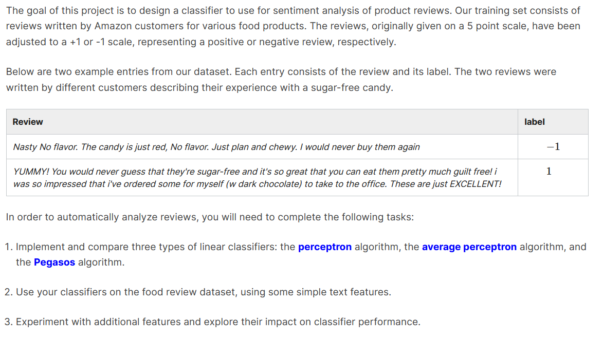
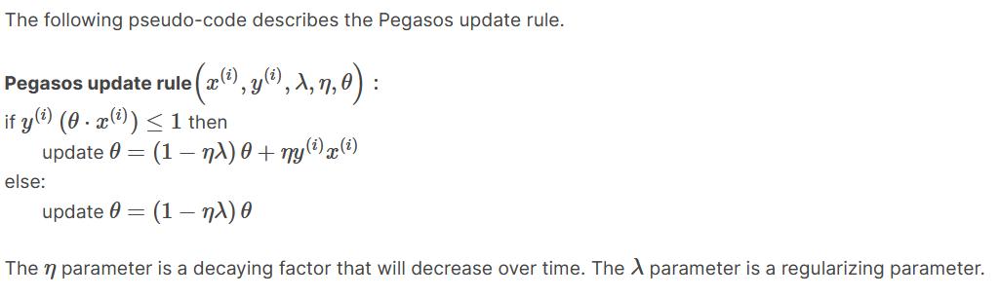

# Sentiment_Analysis
 Automatically classifies the  amazon food reviews as positive or negative comments using machine learning approach.
 
This project is a part of a graduate course on Machine Learning from MIT offered on edx (MIT 6.86x: Machine Learning with python: From Linear Models to Deep Learning). Here, customs functions have been built for implementing different learning algorithms and their accuracy have been tested in the large margin classifier to predict either positve or negative reviews using the bag of words(BOW) approach.

## Project description

There are 4 python files in this project:

## project1.py
This file contains all the custom definition of the functions used to classify the reviews. It includes:
<ul>
<li> Hinge loss implementation</li>
 <li> Perceptron algorithm implementation</li>
 <li> Average perceptron algorithm implementation</li>
 <li> Pegasos algorithm implementation</li>
 <li> Large margin classifier algorithm implementation</li>
 </ul>
 
*Note:* The average perceptron is just a simple modification of the perceptron algorithm and includes the average of all the parameters across nT steps and pegasos algorithm is implemented by incorporating the a bias term in the following:

## main.py
This file contains the methods to call the written function and produce outputs.
## utils.py
This file contains the utility functions to process and prepare dataset.
## test.py
This file contains test data to test the implementation of the functions.

### Accuracy
**Best learning algorithm:** Pegasos

**Validation accuracy after tuning:** 0.8060 with T=25, lambda =0.01

**Test accuracy after stop-words removal:** 0.808

